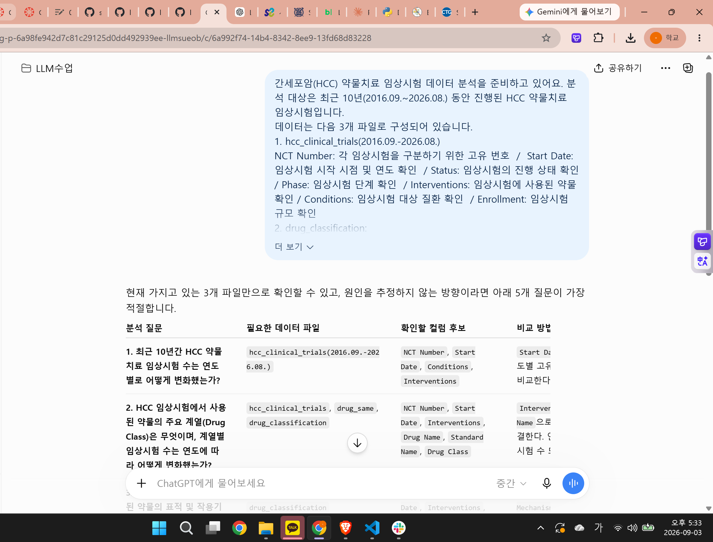

# Chapter 01 제출 답안. AI와 함께하는 데이터 분석의 시작

> 이 파일은 Chapter 01 실습 결과를 정리하여 제출하기 위한 학생용 템플릿입니다.  
> 강사 저장소의 원본 템플릿을 직접 수정하지 말고, 자신의 PC에 복사한 뒤 작성합니다.

---

## 0. 제출 정보

- 이름: 유은송
- GitHub ID: song-03
- 개인 저장소명: `llm-data-analysis-study`
- 작성일: 2026.09.03.
- 사용한 LLM: chatGPT

### 최종 제출 URL


```text
여기에 개인 GitHub 저장소의 chapter01/chapter01.md 파일 URL을 입력하세요.
```

---

## 1. 원래 업무 질문

### 내가 선택한 막연한 질문

간세포암 치료 약물의 최신 치료 연구는 어떻게 되는가?

### 왜 이 질문이 모호하다고 생각했는가?

- 대상: 개발 중인 약물을 볼 것인지, 임상 시험을 볼 것인지, 이미 개발된 약물을 볼 것인지, 국내/해외인지 확실하지 않음.
- 기간: '최신'의 기준이 정확하지 않음.
- 기준: 치료 약물, 연구 기간, 간세포암의 진행 단계 등 어떤 것을 기준으로 보는지 확실하지 않음. 
- 비교 방법: 연도별로 비교할지, 임상시험 단계별로 비교할지, 치료전략별로 비교할지 확실하지 않음. 
- 분석 목적: 단순히 연구 동향을 보기 위함인지, 임상시험 현황을 보기 위한 것인지, 연구되는 약물의 종류 변화를 보기 위함인지 확실하지 않음. 

### 분석 가능한 질문으로 다시 작성

최근 10년(2016.09.~2026.08.) 동안 진행된 간세포암(HCC) 약물치료 임상시험을 대상으로, 임상시험에 사용된 약물을 계열 및 작용기전에 따라 분류하고 연도와 Phase별 분포를 비교했을 때 HCC 약물의 임상개발 동향은 어떻게 변화하였는가?
- 대상: 간세포암(HCC) 약물치료 임상시험
- 기간: 최근 10년(2016.09.~2026.08.)
- 기준: 임상시험에 사용된 약물 계열 및 작용 기전, 연도, phase 별 분포
- 비교 방법: 
    1) 연도별 phase별 임상시험 수 비교 
    2) 연도별 약물 계열 분포 비교
    3) 연도별 약물 표적(작용기전) 분포 비교
    4) phase별 약물 계열 분포 비교
    5) 표적(작용기전) 별 임상 phase 분포 비교

- 분석 목적: HCC 약물의 임상 개발 동향 변화 확인 

### 결과 관찰

기존에는 '간세포암 치료 약물의 최신 치료 연구는 어떻게 되는가?'와 같이 막연한 주제였는데, 이를 대상, 기간, 기준, 비교 방법, 분석 목적으로 나눠 각각 구체화하면서 더 자세해졌다.
- 대상: 간세포암 치료 연구 -> 간세포암 약물치료 임상시험
- 기간: 최신 -> 최근 10년(2016.09.~2026.08.)
- 기준: x -> 임상시험에 사용된 약물 계열 및 작용 기전, 연도, phase 별 분포  (앞서 작성한 답안에 더 자세하게 작성)
- 비교 방법: x -> 연도별로 약물 계열 및 작용기전의 분포 변화를 비교하고, 각 약물 계열의 Phase별 분포를 비교
- 분석 목적: 최신 치료 연구 확인 -> HCC 약물의 임상 개발 동향 변화 확인 


### 나의 해석과 판단

대상과 기간, 기준이 구체화되면서 분석해야 할 자료에 어떤 항목이 있어야하는지, 해당 자료를 어디서 구해야 할지 더 구체적으로 고안할 수 있게 되었다. 기존에는 치료 연구라고 모호하게 생각했으나 임상시험에 등록된 약물이라고 기준을 구체화하면서 clinical.gov 등의 임상시험 등록 사이트를 이용해 분석할 데이터를 다운 받으면 받으면 되겠다고 생각하게 되었다. Intervention에 해당하는 약물 계열(작용 기전)으로 분류하면 연도별 변화나 특징을 비교할 수 있을 것이다. 단순히 임상 시험 수를 세는 것보다는, 어떤 약물 계열이 실제 임상 개발에서 유용하게 사용되고 있는지 분석하는 것이 추후 연구 주제를 잡을 때 더 유용하게 쓰일 것이라고 생각했다. 

### 업무·분석적 의미

이런 분석을 진행하면 최근 HCC 치료제 개발에서 어떤 약물 계열이 주로 연구되어 왔는지 알 수 있을 것이다. 또한 연도별 동향을 확인함으로써 초기 임상 시험 phase(~phase 1)에만 머물러 있는 약물 계열과 후기 임상 시험까지(phase 3~) 진행된 약물 계열을 확인할 수 있을 것이고, 이를 통해 약물 개발의 전반적인 흐름을 확인할 수 있다. 또한 유망한 약물 계열이나 작용 기전을 확인해서 더 자세히 분석하는 데 활용할 수 있고, 이를 통해서 추후 연구 주제를 잡을 수 있을 것이다.

### 한계와 추가 확인 사항

현재 질문으로는 어떠한 약물이 주로 사용되는지 확인은 할 수 있으나, 약물 계열이나 기전까지는 확인할 수 없을 것이다. 내가 직접 해당 약물의 계열을 분류해야 한다. 또한 같은 약물 계열이라고 하더라도 자세한 작용 기전은 차이가 있을 수 있으므로 추가적으로 확인해야 한다. 또한 병용 요법을 사용하는 경우에는 분류가 어려울 수 있다. 이를 하나의 치료 전략으로 보고 따로 분류해야 할지, 혹은 각 약물 계열로 합쳐 분석해야 할지 정해야 한다.
또한 해당 분석만으로는 각 약물의 안전성과 효과를 완전히 파악할 순 없다. 임상 시험이 많이 진행되었다는 것만으로 효과를 단정지을 수 없다. 

### Evidence


---

## 2. 질문과 필요한 데이터 연결

### 필요한 데이터 파일

- [ ] 'hcc_clinical_trials(2016.09.-2026.08.).csv'
- [ ] 'drug_classfication.csv'
- [ ] 'drug_same.csv' 

(교수님 예시)
질문: 카테고리별 completed 주문 금액을 비교하고 싶다.

필요 파일
- products.csv
- orders.csv
- order_items.csv


### 필요한 컬럼 후보

| 파일 | 필요한 컬럼 | 필요한 이유 |
|hcc_clinical_trials(2016.09.-2026.08.).csv| CT Number | 각 임상시험 구분하기 위한 CT(clinical Trial) 번호 |
|hcc_clinical_trials(2016.09.-2026.08.).csv| Start date | 시작 시점 확인, 연도별 분류 |
|hcc_clinical_trials(2016.09.-2026.08.).csv| Status | 종료되었는지, 진행 중인지, 실패했는지(withdrawl), 성공했는지 확인  |
|hcc_clinical_trials(2016.09.-2026.08.).csv|| Phase | phase 별로 확인하기 위함 |
|hcc_clinical_trials(2016.09.-2026.08.).csv|Interventions| 어떤 약물을 사용했는지 확인 |
|hcc_clinical_trials(2016.09.-2026.08.).csv|Conditions|어떤 환자군을 대상으로 했는지 확인 |
|hcc_clinical_trials(2016.09.-2026.08.).csv|Enrollment|임상시험 규모를 확인하기 위해 사용 |
|drug_classification.csv|Drug Name|약물의 이름을 확인하기 위함 |
|drug_classification.csv|Drug Class|약물을 계열별로 분류하기 위함 |
|drug_classification.csv|Drug target|약물의 작용 기전을 분류하기 위함|
|drug_same.csv|Drug Name|약물의 이름을 분류하기 위함|
|durg_same.csv|standard Name|약물의 이름이 여러가지로 분류된 경우 하나로 통일하기 위함|

(교수님 예시)
|파일 | 필요한 컬럼 | 필요한 이유|
|products.csv|product_id|주문 상품 정보와 상품 카테고리를 연결하기 위해 필요|
|products.csv|category|카테고리별로 주문 금액을 비교하기 위해 필요|
|orders.csv|order_id|주문 정보와 주문 상세 정보를 연결하기 위해 필요|
|orders.csv|order_status|completed 상태인 주문만 필터링하기 위해 필요|
|order_items.csv|order_id|주문 상품이 어떤 주문에 포함되었는지 확인하기 위해 필요|
|order_items.csv|product_id|주문 상품을 상품 정보와 연결하기 위해 필요|
|order_items.csv|quantity|주문 수량을 반영한 주문 금액을 계산하기 위해 필요|
|order_items.csv|unit_price|상품 단가를 이용해 주문 금액을 계산하기 위해 필요|

### 데이터 연결 관계

hcc_clinical_trials(2016.09.-2026.08.).csv
 -CT Number: 임상시험 식별용 번호
 -Interventions: 약물 이름 확인
    ↓ 같은 약물인데 여러 이름을 가진 경우 다음 csv를 이용해 표준화
drug_same.csv : 약물 이름 표준화
 -Drug Name
    ↓ 약물명 표준화
 -Standard Name
    ↓ 약물 계열 및 타겟 정보 확인
drug_classification: 약물 분류 정보 추가
 -Drug class
 -Drug target
   ↓ 연도별, phase 단계별 분석
hcc_clinical_trials(2016.09.-2026.08.).csv
 -Start date
 -Status
 -Phase
    
(교수님 예시)
customers.customer_id
        ↓
orders.customer_id

orders.order_id
        ↓
order_items.order_id

products.product_id
        ↓
order_items.product_id

### 결과 관찰

질문에 답하기 위해서 다음과 같은 여러 정보가 필요함을 확인했다.
-Start date, status, Intervention, drug name, drug target, drug class
같은 약물임에도 불구하고 임상시험에서 사용하는 약물의 코드명이 따로 존재하는 경우가 있기 때문에 이를 하나의 이름으로 통일하기 위한 별도의 정리된 drug_same 파일 역시 필요하다. 
또한 임상시험에서는 해당 약물의 계열과 기준을 따로 기재하지 않을 수 있으므로 약물 이름에 대한 계열, 타겟 정보 파일도 따로 필요하다.
따라서 이 3가지 파일을 따로 준비한 후 연결해야 연도, phase 별 작용 기전, 계열 분화를 확인할 수 있을것이다.

(교수님 예시)
질문을 분석하기 위해서는 상품 카테고리 정보, 주문 상태, 주문 수량, 가격 정보가 필요함을 확인했다. product csv에서 상품의 카테고리 등을 확인하고, order에서 주문 상태를 확인하고, orter item에서 각 상품 수량과 가격을 확인할 수 있다. 따라서 product ID와 order ID를 기준으로 연결해야 카테고리별 주문 금액을 확인할 수 있다.

### 나의 해석과 판단

위의 데이터가 준비되면 분석 질문에 대부분 답할 수 있을 것이라 생각한다. 다만 환자 condition 별로 결과가 달라질 수 있으므로 (ex. HCC 단계가 어디인지, HCC 외에 다른 동반 질환을 가진 환자인지) 이에 대한 고려 역시 필요한데, 이 내용까지 첫 분석에서 포함하면 너무 복잡해지기 때문에 우선 초기 분석에서는 간소화하여 분석하는 것이 적절하다고 보았다.
또한 병용요법의 경우에는 각 약물을 개별적으로 볼 것인지, 혹은 병용한 것을 하나의 치료 전략으로 볼 것인지 역시 판단해야 한다. 이는 실제 데이터를 보고 결정해야 할 것으로 보이며, 지금 상태로는 병용 전략을 하나의 전략으로 봐야 한다고 생각한다.

(교수님 예시)
위의 데이터가 준비되면 대부분 답할 수 있다. 주문 금액은 수량 * unit price로 계산하고, satus에서 completed된 주문만 선택해 카테고리별로 금액을 합산하면 주문 금액을 비교할 수 있을 것이다. 

### 업무·분석적 의미
미리 질문과 데이터 구조를 연결해 내가 알고 싶은 내용을 실제 데이터를 통해 확인할 수 있는 것인지 판단할 수 있다. 무작정 임상시험 데이터만 받아 분석했다면 방대한 약물들과 여러가지 이름으로 인해 분석에 혼선이 있었을 수도 있다. 이를 방지하기 위해 미리 분석 전에 데이터 구조를 정리해놓음으로써 추후 분석을 용이하게 했다.

(교수님 예시)
분석 전 데이터 구조와 질문을 연결해보며 하나의 파일이 아닌 여러 파일을 연결해야 확인할 수 있다는 점을 확인할 수 있었다. 또한 카테고리, 주문 금액, 상태 등 필요한 정보가 다른 파일에 존재하기 때문에 ID를 기준으로 파일 간 관계를 파악하는 것이 주요하다. 이를 통해 실제 분석 전 명확하게 필요한 정보를 정리할 수 있다.

### 한계와 추가 확인 사항

실제 clinicaltrials.gov에서 일반인 접근 권한으로 위에서 언급한 내용을 모두 다운받을 수 있는지 확인하지 못했다.
실제 csv 파일에서의 컬럼 명, 데이터 타입을 확인하지 못했다.
Start date를 연도별로 변환할 수 있는지 확인해야 한다.
Intervention에 약물 외 기타 치료가 포함된 경우가 있는지 확인해야 한다.
임상시험 데이터의 Interventions 컬럼에 여러 약물이 하나의 값으로 포함되어 있을 수도 있으므로, 약물 단위로 분리하는 전처리 과정이 필요하다.

(교수님 예시)
취소나 환불 정보가 있는 경우 completed 만으로 최종 매출을 확인할 수 있는지 추가로 확인해야 한다.
실제 csv 파일의 컬럼 이름과 데이터 타입을 확인하지 못했다.


### Evidence


---

## 3. LLM에게 분석 질문 후보 요청

### 사용 목적
아이디어와 초안을 만들기 위해 보조 도구로 사용한다.
내가 미처 고려하지 못한 다른 정보가 있는지 확인한다.

### 사용한 Prompt
간세포암(HCC) 약물치료 임상시험 데이터 분석을 준비하고 있어요. 분석 대상은 최근 10년(2016.09.~2026.08.) 동안 진행된 HCC 약물치료 임상시험입니다. 
데이터는 다음 3개 파일로 구성되어 있습니다.
1. hcc_clinical_trials(2016.09.-2026.08.) 
NCT Number: 각 임상시험을 구분하기 위한 고유 번호  /  Start Date: 임상시험 시작 시점 및 연도 확인  / Status: 임상시험의 진행 상태 확인  / Phase: 임상시험 단계 확인  / Interventions: 임상시험에 사용된 약물 확인 / Conditions: 임상시험 대상 질환 확인  / Enrollment: 임상시험 규모 확인 
2. drug_classification: 
Drug Name: 약물명 / Drug Class: 약물 계열 /Drug Target / Mechanism: 약물의 표적 및 작용기전 
 
3. drug_same 
Drug Name: 원래 기록된 약물명 / Standard Name: 동일 약물의 여러 이름을 하나의 표준 이름으로 통일하기 위한 컬럼 
 
분석 목적은 최근 10년간 HCC 임상시험에서 사용된 약물을 계열 및 작용기전에 따라 분류하고, 
연도와 Phase에 따라 HCC 약물의 임상개발 동향이 어떻게 변화했는지 확인하는 것이다.
 
초보 데이터 분석자가 먼저 확인할 분석 질문 5개를 제안해 주세요. 
각 질문마다 다음 내용을 함께 적어 주세요. 
- 필요한 데이터 파일 
- 확인할 컬럼 후보 
- 어떤 방식으로 비교하면 되는지 
 초보 데이터 분석자가 먼저 확인할 분석 질문 5개를 제안해 주세요.
각 질문마다 필요한 데이터 파일과 확인할 컬럼 후보도 적어 주세요.
원인을 단정하지 말고, 현재 데이터로 확인 가능한 질문만 제안해 주세요.

### LLM 답변 요약

1. 최근 10년간 HCC 약물치료 임상시험 수는 연도별로 어떻게 변화했는가?
2. HCC 임상시험에서 사용된 약물의 주요 계열(Drug Class)은 무엇이며, 계열별 임상시험 수는 연도에 따라 어떻게 변화했는가?
3. HCC 임상시험에서 사용된 약물의 표적 및 작용기전은 어떤 유형으로 구성되어 있으며, 그 분포는 연도에 따라 어떻게 변화했는가?
4. Phase에 따라 사용되는 약물 계열과 작용기전의 분포에는 어떤 차이가 있는가?
5. 최근 10년 동안 각 Phase에서 사용되는 약물 계열 및 작용기전의 구성은 시간에 따라 어떻게 변화했는가?

### 결과 관찰


LLM이 어떤 방향의 질문을 주로 제안했는지 사실 위주로 작성하세요.

### 나의 해석과 판단

좋았던 제안과 그대로 사용하기 어려운 제안을 구분해서 작성하세요.

### 업무·분석적 의미

LLM이 분석 시작 단계에서 어떤 도움을 줄 수 있다고 생각하는지 작성하세요.

### 한계와 추가 확인 사항

LLM 답변에서 실제 데이터로 검증해야 할 내용을 작성하세요.

### Evidence



---

## 4. LLM 제안 검증

LLM 제안 중 하나 이상을 선택해 검토합니다.

| 검증 항목 | 확인 내용 |
| --- | --- |
| 선택한 LLM 제안 |  |
| 필요한 파일 |  |
| 필요한 컬럼 |  |
| 계산 범위 |  |
| 실제 데이터 확인 필요 여부 |  |
| 원인 단정 여부 |  |
| 최종 판단 | 사용 / 수정 후 사용 / 보류 |

### 내가 수정한 내용

```text
LLM 제안을 수정했다면 무엇을 어떻게 바꿨는지 작성하세요.
```

### 결과 관찰

검증 과정에서 확인된 사실을 작성하세요.

### 나의 해석과 판단

왜 `사용 / 수정 후 사용 / 보류` 중 해당 결정을 내렸는지 작성하세요.

### 업무·분석적 의미

LLM 제안을 검증하지 않고 바로 사용하는 경우 어떤 문제가 생길 수 있는지 작성하세요.

### 한계와 추가 확인 사항

아직 실제 데이터로 검증하지 못한 부분을 명확히 작성하세요.

### Evidence


---

## 5. Prompt Log

- 사용 목적:
- 입력 Prompt 요약:
- LLM 답변 요약:
- 실제 반영 여부:
- 사람이 검증한 항목:
- 사람이 수정한 내용:
- 남은 확인 사항:

### 결과 관찰

LLM 사용 기록에서 어떤 의사결정 과정을 확인할 수 있는지 작성하세요.

### 나의 해석과 판단

Prompt Log를 남기는 것이 왜 필요한지 자신의 말로 작성하세요.

### Evidence


---

## 6. 개인정보와 Secret 보호 확인

다음 항목을 확인합니다.

- [ ] 실제 이름·이메일·전화번호 등 고객 개인정보를 Prompt에 사용하지 않았습니다.
- [ ] API Key를 코드나 Notebook에 직접 작성하지 않았습니다.
- [ ] `.env` 실제 내용을 캡처하거나 업로드하지 않았습니다.
- [ ] GitHub Token, 비밀번호, 내부 URL이 캡처에 보이지 않습니다.
- [ ] 제출 전 이미지까지 다시 확인했습니다.

### 나의 판단

이번 실습에서 어떤 정보는 LLM 또는 Public GitHub에 올리면 안 된다고 판단했는지 작성하세요.

---

## 7. Chapter 01 Notebook 확인

Notebook:

```text
notebooks/ch01_ai_data_analysis_intro.ipynb
```

### 내 환경 상태

- [ ] 아직 환경설정 전이라 Notebook 위치만 확인했습니다.
- [ ] 환경설정이 완료되어 Notebook을 직접 실행했습니다.

### 환경설정 완료 학생만 작성

#### 실행한 코드

```python
from pathlib import Path

import pandas as pd
import numpy as np
import matplotlib.pyplot as plt
import seaborn as sns

DATA_DIR = Path('../data/raw')
sns.set_theme(style='whitegrid')
```

#### 실행 결과

```text
오류 없이 실행되었는지 작성하세요.
```

#### 결과 관찰

실행 결과에서 확인한 사실을 작성하세요.

#### 나의 해석과 판단

현재 Notebook이 본격 분석이 아니라 starter scaffold라는 의미를 자신의 말로 설명하세요.

#### 한계와 추가 확인 사항

Chapter 02 또는 Chapter 03에서 추가로 확인해야 할 내용을 작성하세요.

#### Evidence


> 환경설정 전이라면 이 이미지는 생략할 수 있습니다.

---

## 8. Chapter 01 최종 해석

### 이번 장에서 가장 중요하다고 생각한 내용

```text
자신의 말로 3~5문장 작성하세요.
```

### LLM을 데이터 분석에 사용할 때 가장 조심해야 할 점

```text
자신의 판단을 작성하세요.
```

### 사람과 LLM의 역할 차이

| 항목 | LLM이 도울 수 있는 부분 | 사람이 책임져야 하는 부분 |
| --- | --- | --- |
| 질문 정의 |  |  |
| 데이터 확인 |  |  |
| 코드 작성 |  |  |
| 결과 해석 |  |  |
| 최종 판단 |  |  |

### 다음 Chapter에서 확인하고 싶은 것

```text
이번 장에서 남은 의문이나 Chapter 02~03에서 확인하고 싶은 내용을 작성하세요.
```

---

## 9. 최종 제출 체크리스트

- [ ] 원래 업무 질문과 구체화한 분석 질문을 작성했습니다.
- [ ] 질문에 필요한 데이터 파일과 컬럼 후보를 정리했습니다.
- [ ] LLM Prompt와 답변 요약을 작성했습니다.
- [ ] LLM 제안을 실제 데이터 관점에서 검증했습니다.
- [ ] 각 핵심 STEP의 결과 관찰을 작성했습니다.
- [ ] 각 핵심 STEP의 나의 해석과 판단을 작성했습니다.
- [ ] 업무·분석적 의미를 작성했습니다.
- [ ] 한계와 추가 확인 사항을 작성했습니다.
- [ ] 핵심 실행 Evidence 이미지를 첨부했습니다.
- [ ] 이미지가 Markdown에서 정상 표시됩니다.
- [ ] 개인정보가 없습니다.
- [ ] API Key·Secret·Token이 없습니다.
- [ ] 개인 GitHub 저장소에 업로드했습니다.
- [ ] GitHub에서 Markdown과 이미지가 정상 표시됩니다.
- [ ] 아래 최종 파일 URL이 정상적으로 열립니다.

### 최종 파일 URL

```text
https://github.com/<내-GitHub-ID>/llm-data-analysis-study/blob/main/chapter01/chapter01.md
```

---

## 10. 교수자 확인용 요약

### 수행 상태

- [ ] COMPLETE
- [ ] PARTIAL

### 내가 가장 중요하게 내린 판단 1개

```text
여기에 작성하세요.
```

### 아직 확인이 필요한 내용 1개

```text
여기에 작성하세요.
```
