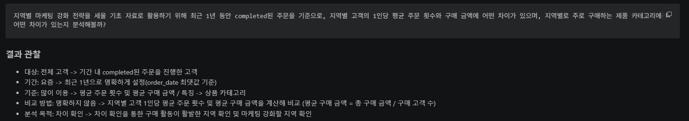
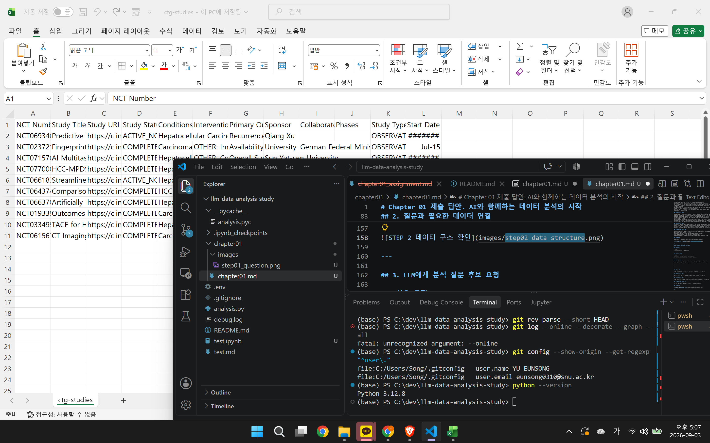
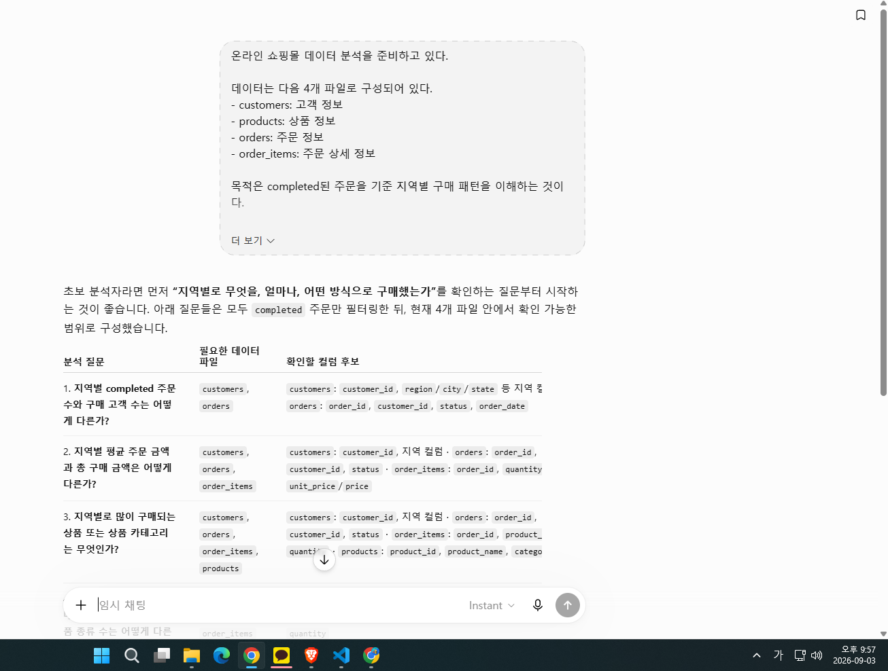
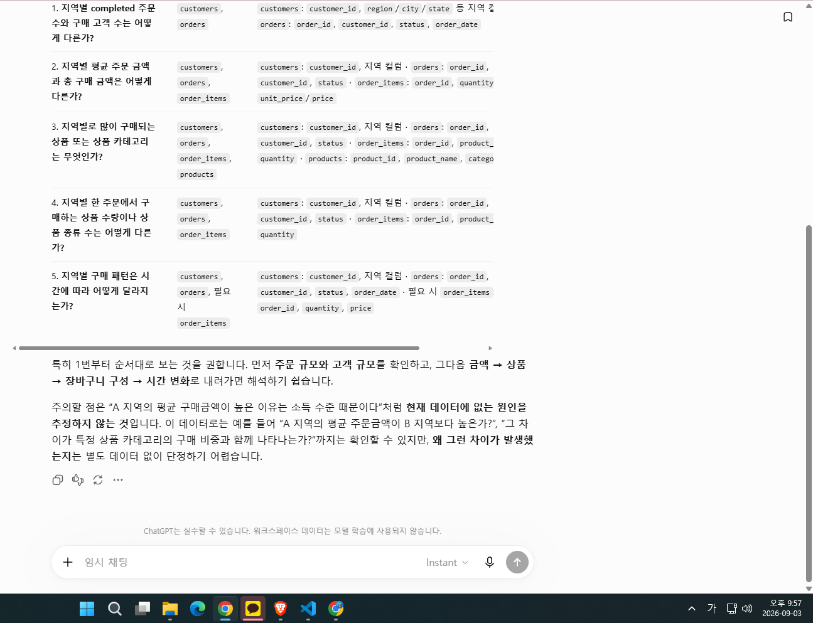
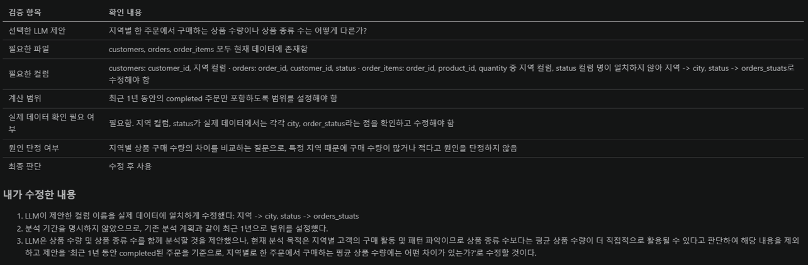
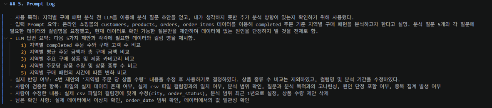
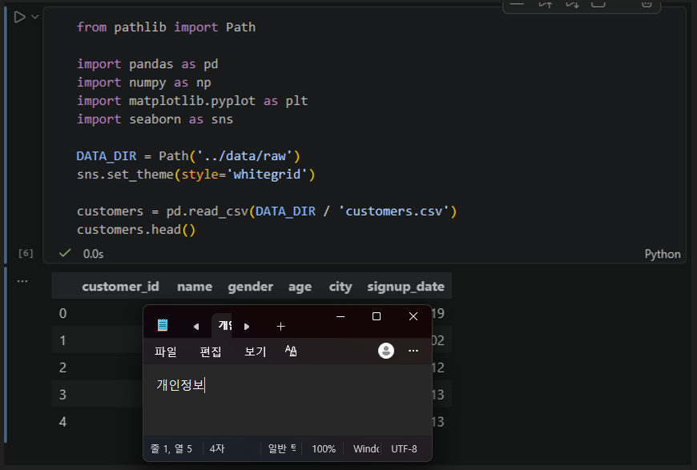

# Chapter 01 제출 답안. AI와 함께하는 데이터 분석의 시작

---

## 0. 제출 정보

- 이름: 유은송
- GitHub ID: song-03
- 개인 저장소명: `llm-data-analysis-study`
- 작성일: 2026.09.03.
- 사용한 LLM: chatGPT

### 최종 제출 URL
```text
https://github.com/song-03/llm-data-analysis-study/blob/main/chapter01/chapter01.md
```

---

## 1. 원래 업무 질문

### 내가 선택한 막연한 질문
```text
요즘 어떤 고객들이 쇼핑몰을 많이 이용할까? 어떤 특징이 있을까?
```
### 왜 이 질문이 모호하다고 생각했는가?

- 대상: 어떤 고객을 비교할 것인지 정확하지 않음. 고객을 성별, 연령대, 지역 등 어떤 것을 비교할지 확실하지 않음.
- 기간: 요즘의 정확한 기간을 명시하지 않음.
- 기준: 많이 이용한다는 것의 기준이 확실하지 않음. 주문 횟수 혹은 주문 수량, 주문 금액 중 어떤 것을 기준으로 비교할 것인지 정하지 않음. 어떤 특징이 있는지 정확하지 않음.
- 비교 방법: 고객의 특성 별로 어떤 값을 비교할 것인지 정하지 않음.
- 분석 목적: 단순히 고객 간의 차이를 확인하려는 것인지, 이를 통해서 어떤 이후 분석에 활용할 것인지 정확하지 않음. 

### 분석 가능한 질문으로 다시 작성
```text
최근 1년 동안 completed된 주문을 기준으로, 지역별 고객의 1인당 평균 주문 횟수와 구매 금액에 어떤 차이가 있으며, 지역별로 주로 구매하는 제품 카테고리에는 어떤 차이가 있을까? 이를 이용해 지역별 마케팅 강화 후보군과 전략을 세울 수 있을까?
```
### 결과 관찰

- 대상: 전체 고객 -> completed된 주문을 진행한 고객
- 기간: 요즘 -> 최근 1년으로 명확하게 설정
- 기준: 많이 이용 -> 평균 주문 횟수 및 평균 구매 금액 / 특징 -> 상품 카테고리
- 비교 방법: 명확하지 않음 -> 지역별 고객 1인당 평균 주문 횟수 및 평균 구매 금액을 계산해 비교 
- 분석 목적: 차이 확인 -> 차이 확인을 통한 구매 활동이 활발한 지역 확인 및 마케팅 강화할 지역 확인 

기존 질문에서 명확하지 않았던 대상, 기간, 기준, 비교방법, 분석목적을 더 자세히 정의하였다. 

### 나의 해석과 판단

기존에는 대상이 명확하지 않았으므로 '고객'을 어떻게 정의할지 확실하지 않았다. 이를 completed된 주문을 진행한 고객으로 한정함으로써 어떤 데이터를 얻어야 할지 명확하게 하였다.  환불하거나 취소한 주문 건까지 포함할 경우 혼선을 줄 수 있기 때문에 이를 제외하고 실제 유의미한 구매 활동만 포함하고자 하였다. 
기간 역시 최근 1년으로 한정하여 현실적으로 가능한 숫자의 데이터를 분석하고자 했다. 너무 짧은 기간을 사용하는 경우 특별한 이벤트 등의 영향을 받을 수 있고, 너무 길면 최근 트렌드가 반영되지 않을 수 있다고 생각했다.
기준 역시 '많이 이용'을 구매 금액 및 구매 횟수로 정하였다. 이를 통해 고객이 얼마나 자주 이용하는지, 어느 정도의 금액을 지출하는지를 보고자 했다. 한 가지 지표만으로는 고객이 이용하는 정도를 확실히 설명하기 어려우므로 2개 지표를 같이 비교하는 것이 적절하다고 생각했다. 이때 지역별 인구 수 차이로 인해 지역별 결과가 영향을 받을 수 있으므로 고객 1인당 평균 주문 횟수와 평균 구매 금액을 계산해 비교하고자 했다.
또한 이러한 분석 결과를 이용해 지역별 구매 활동을 비교해 활발한 지역을 파악하고, 이를 통해 마케팅을 우선적으로 강화할 지역을 찾는 것에 사용하고자 하였다. 지역 방송이나 현수막 등 지역 별로 마케팅을 달리 할 수 있기 때문에 이에 활용하고자 하였다. 


### 업무·분석적 의미

지역별 고객 1인당 평균 주문 횟수와 구매 금액을 비교하면 어떤 지역의 고객이 더 자주 구매하고, 더 많은 금액을 지출하는지 파악할 수 있다. 이를 활용해서 지역별 고객 특성이나 구매 패턴을 확인할 수 있고, 지역별 마케팅 전략에 활용할 기초 자료를 분석할 수 있다. 지역별 구매가 높은 지역은 마케팅을 강화하고, 지역별 구매가 낮은 지역은 그 이유를 분석해 성장할 포인트를 찾을 수 있다. 
또한 이렇게 분석 질문을 구체화함으로써 분석을 위해 어떤 정보가 포함된 데이터를 획득해야 할지 미리 정할 수 있다. 


### 한계와 추가 확인 사항

분석 결과가 나와도 지역별 구매 활동의 차이 원인을 확인하기 어렵다. 또한 지역별 구매 활동에 차이가 나도 그 원인이 지역인지, 혹은 성별이나 연령 차이인지 확정하기 어렵다.
또한 분석 전 지역을 구별할 수 있는 컬럼이 저장되어 있는지, 표기 방식의 차이가 있는지 확인해야 한다. 
또한 마케팅에 활용하기 위해서는 이 분석 결과 외에도 지역별 마케팅 비용이나 고객 규모, 시장 정보 등이 필요하다. 

### Evidence



---

## 2. 질문과 필요한 데이터 연결

### 필요한 데이터 파일

- [ x ] `customers.csv`
- [ x ] `products.csv`
- [ x ] `orders.csv`
- [ x ] `order_items.csv`

### 필요한 컬럼 후보

| 파일 | 필요한 컬럼 | 필요한 이유 |
| --- | --- | --- |
| `customers.csv` | `customer_id` | 고객 정보와 주문 정보를 연결하고 지역별로 고객 수를 계산해야 함. 동명이인이 있을 수 있으므로 id 식별 번호를 사용함 |
| `customers.csv` | `city` | 고객을 지역별로 구분하여 비교하기 위함 |
| `products.csv` | `product_name` | 어떤 제품인지 확인하기 위함 |
| `products.csv` | `product_id` | order_items 파일에서 어떤 제품인지 연결하기 위함 |
| `products.csv` | `category` | 지역별로 주로 구매하는 제품 카테고리를 확인하기 위함 |
| `orders.csv` | `order_id` | 각 주문을 구분하고 주문 상세 데이터와 연결하여 주문 횟수를 계산하기 위해 필요 |
| `orders.csv` | `customer_id` | 각 주문이 어떤 고객의 주문인지 확인해야 함 |
| `orders.csv` | `order_date` | 주문을 한 시점에 대한 정보가 필요, 최근 1년 건만 비교할 것임 |
| `orders.csv` | `order_status` | 주문이 완료된 건인지, 환불된 건인지, 취소된 건인지 구별하기 위해 필요 |
| `order_items.csv` | `order_id` | orders에 해당하는 상품 정보를 확인하기 위해 필요 |
| `order_items.csv` | `quantity` | 주문한 상품의 개수를 확인하고 구매 금액을 계산하기 위해 필요 |
| `order_items.csv` | `unit_price` | 실제 주문에 기록된 상품 단위 별 가격으로 구매 금액을 계산하기 위해 필요 |


### 데이터 연결 관계
```text
customers.customer_id
         ↓
orders.customer_id
각 주문이 어떤 고객의 주문인지 연결, 이를 통해 지역별로 주문을 연결 가능함

orders.order_id 
          ↓
order_items.order_id
각 주문에 대한 상품을 연결 가능함

products.product_id
         ↓
order_items.product_id
주문에 대한 제품 정보를 연결 가능함. 이를 통해 카테고리 확인 가능함
```

### 결과 관찰

고객 주문 정보와 주문 정보, 주문 상세 정보, 상품 정보를 각각 확인한 후 연결해야 했다.
customer.csv의 city를 이용해 고객의 지역을 구분해야 하고,
order.csv의 date와 status를 이용해 최근 1년 completed된 주문만을 확인해야 했다. 
또한 orders_item의 quantity 정보와 unit_price 정보가 있어야 주문 금액을 계산할 수 있고
products.csv의 카테고리 정보가 있어야 지역별 카테고리 차이를 계산할 수 있다. 
따라서 이러한 정보들을 모두 각 파일에서 확인한 후, 연결해서 분석해야했다.

### 나의 해석과 판단

현재의 데이터를 이용하면 1인당 평균 주문 횟수 및 구매 금액, 그리고 지역별 제품 카테고리 차이를 확인할 수 있다고 판단했다. 
customers.csv <-> orders.csv 를 통해 지역별 고객 주문 내용을 확인하고,
orders.csv <-> order_items.csv 를 통해 주문 횟수 및 금액을 확인하고,
products.csv 를 연결하면 상품별 카테고리도 연결할 수 있다고 생각했다.
다만 실제 분석을 진행하기 전에 각 파일별 식별 번호가 정상적으로 연결되는지, 각 컬럼의 내용이 내가 원하는 바가 맞는지 확인해야 할 필요성을 느꼈다.

### 업무·분석적 의미

분석 전 질문과 데이터 구조를 먼저 연결하면 원하는 분석 결과를 위해 어떤 정보가 필요한지 미리 확인할 수 있다. 이를 통해서 분석 중간에 필요한 데이터가 없는 상황을 방지할 수 있다. 
또한 데이터 구조를 미리 파악하면 주문 횟수나 금액을 잘못 계산하는 오류를 방지할 수 있다. 

### 한계와 추가 확인 사항

products 파일에서도 price 정보가 있고, orders 파일에서도 unit_price 정보가 있다. 주문 건을 바탕으로 비교할 계획이기 때문에 orders 파일을 사용하려고 하나, 왜 정보가 2개인지, 별개의 정보인지, 왜 따로 적혀있는지 그 이유를 파악해야 한다.
customer_id, order_id, product_id 의 데이터 타입이 서로 일치하는지 확인해야 한다. 또한 각 데이터의 데이터 타입을 미리 확인해야 한다. order_date가 날짜 형식으로 지정되어 있는지도 확인해야 한다. quantity나 unit_price도 숫자형으로 데이터 타입이 지정되어 있는지, 음수나 결측값 등 이상값이 없는지도 확인해야 한다.
하나의 주문에 여러 개의 상품이 포함된 경우 데이터 구성이 어떤 식으로 되어있는지 확인해야 한다. 
order_date에서 최근 1년이라는 범위를 커버할 수 있는 데이터 양을 보유하고 있는지 확인해야 한다. 


### Evidence

필요한 경우 관계도 또는 데이터 파일 확인 화면을 첨부하세요.



---

## 3. LLM에게 분석 질문 후보 요청

### 사용 목적
```text
LLM을 정답 생성기가 아니라 아이디어와 초안을 만드는 보조 도구로 사용한다. 추가로 더 필요한 정보가 있을지, 현실적으로 가능한 분석 범위인지 등의 추가 정보를 얻기 위해 사용한다.
```
### 사용한 Prompt
```text
온라인 쇼핑몰 데이터 분석을 준비하고 있다.

데이터는 다음 4개 파일로 구성되어 있다. 
- customers: 고객 정보
- products: 상품 정보
- orders: 주문 정보
- order_items: 주문 상세 정보

목적은 completed된 주문을 기준 지역별 구매 패턴을 이해하는 것이다. 

초보 데이터 분석자가 먼저 확인할 분석 질문 5개를 제안하고,
각 질문마다 필요한 데이터 파일과 확인할 컬럼 후보도 적고,
원인을 단정하지 말고, 현재 데이터로 확인 가능한 질문만 제안해 달라.
```
### LLM 답변 요약

1. 지역별 completed 주문 수와 구매 고객 수 비교: customers, orders의 customer_id, order_id, status, 지역 컬럼 정보를 확인하고 completed 주문을 기준으로 지역별 주문 수와 구매 고객 수를 비교.
2. 지역별 평균 주문 금액과 총 구매 금액 비교: customers, orders, order_items의 customer_id, order_id, status, 지역 컬럼, quantity, price 정보를 확인하고 지역별 평균 주문 금액과 총 구매 금액을 비교.
3. 지역별 주요 구매 상품 및 카테고리 비교: customers, orders, order_items, products의 customer_id, order_id, product_id, status, 지역, quantity, product_name, category 정보를 확인하고 지역별로 많이 구매된 상품과 카테고리를 비교.
4. 지역별 주문당 상품 수량 및 상품 종류 수 비교: customers, orders, order_items의 customer_id, order_id, product_id, status, 지역, quantity 정보를 확인하고 지역별 주문당 평균 구매 수량과 상품 종류 수를 비교.
5. 지역별 구매 패턴의 시간별 변화 비교: customers, orders와 필요 시 order_items의 customer_id, order_id, status, order_date, 지역, quantity, price 정보를 확인하고 completed 주문을 기준으로 시간에 따른 지역 구매 패턴의 변화를 비교.

### 결과 관찰

프롬프트에서 언급한 조건 (주문 상태, 지역)에 맞게 지역 단위 계산 및 비교에 초점을 맞춰 질문을 제안했고, 제시한 대로 원인을 추정하지 않았다. 또한 구매 패턴 내용으로 주문 수, 고객 수, 평균 주문 금액, 총 구매 금액, 주요 구매 상품 및 카테고리, 수량, 종류 수, 시간 별 변화 비교 등이 포함되어있었다.


### 나의 해석과 판단

1번~4번의 내용은 현재 분석 목적과 잘 맞다고 생각했다. 특히 평균 외 총 구매 건수 및 금액을 비교하는 것 역시 추후 마케팅을 위한 시장 규모의 정보로 활용하기 좋을 것 같다. 지역별로 주문 상품 수량을 비교하는 것 역시 활용할 수 있다고 생각했다. 이는 단순한 추측이지만, 만약 택배가 어렵거나 외진 지역의 경우 한 번에 대량 규모할 가능성도 있으므로 이러한 패턴이 관찰된다면 벌크로 더 싸게 파는 마케팅을 제안할 수도 있다.
다만 4번의 상품 종류 수 비교 및 5번 시간별 변화 비교는 그대로 사용하기 어렵다고 생각했다. 우선 상품 종류 수의 경우 내 분석 목적과 크게 관련이 없다는 생각이 들었다. 또한 시간별 변화의 경우 지역별로 나눌 의미가 없다는 생각이 들었다. 최근 1년만 분석하며 트렌드 파악을 목적으로 하고 있기 때문에, 월별 혹은 분기별로 인한 영향이 클 수 있으므로 지역별로 나눠 분석하기보다는 총 합산해서 전체적인 경향을 파악하는 것이 좋다고 생각했다. 또한 컬럼명이 실제 데이터와 일치하지 않아 이를 컬럼의 용어로 고쳐 사용해야 한다. 또한 최근의 범위를 설정하지 않았다. 

### 업무·분석적 의미

LLM을 활용하면 기존에 내가 생각했던 방향 외에도 다양한 방향의 질문을 생각할 수 있다. 이를 통해 의외의 패턴을 파악하거나, 여러 관점에서 바라보며 분석 질문 후보를 얻을 수 있다. 또한 어떤 데이터가 필요한지 함께 제안함으로써 초안을 만드는 데 도움이 된다. 지역별 구매라는 큰 패턴 안에서도 카테고리, 빈도, 총/평균 등 세부 분석 방향을 나누어 생각하는 것에도 도움이 되었다. 

### 한계와 추가 확인 사항

LLM이 제안한 파일과 컬럼명을 실제 데이터 구조와 비교해 확인해야 한다. 컬럼명이 다른 경우도 있어 실제 csv 기준으로 검증해야 한다.
중복 및 누락된 데이터가 있는지 확인해야 한다.
또한 제안한 질문이 분석 가능한 질문이어도 내 분석 목적에 필요한 것인지 확인해야 한다. 

### Evidence



---

## 4. LLM 제안 검증

LLM 제안 중 4번 제안을 선택해 검토했다.


| 검증 항목 | 확인 내용 |
| --- | --- | 
| 선택한 LLM 제안 | 지역별 한 주문에서 구매하는 상품 수량이나 상품 종류 수는 어떻게 다른가? |
| 필요한 파일 | customers, orders, order_items 모두 현재 데이터에 존재함 |
| 필요한 컬럼 | customers: customer_id, 지역 컬럼 · orders: order_id, customer_id, status · order_items: order_id, product_id, quantity 중 지역 컬럼, status 컬럼 명이 일치하지 않아 지역 -> city, status -> orders_stuats로 수정해야 함 | 
| 계산 범위 | 최근 1년 동안의 completed 주문만 포함하도록 범위를 설정해야 함 | 
| 실제 데이터 확인 필요 여부 | 필요함. 지역 컬럼, status가 실제 데이터에서는 각각 city, order_status라는 점을 확인하고 수정해야 함 |
| 원인 단정 여부 | 지역별 상품 구매 수량의 차이를 비교하는 질문으로, 특정 지역 때문에 구매 수량이 많거나 적다고 원인을 단정하지 않음|
| 최종 판단 | 수정 후 사용 |

### 내가 수정한 내용
```text
1. LLM이 제안한 컬럼 이름을 실제 데이터에 일치하게 수정했다: 지역 -> city, status -> orders_stuats
2. 분석 기간을 명시하지 않았으므로, 기존 분석 계획과 같이 최근 1년으로 범위를 설정했다.
3. LLM은 상품 수량 및 상품 종류 수를 함께 분석할 것을 제안했으나, 현재 분석 목적은 지역별 고객의 구매 활동 및 패턴 파악이므로 상품 종류 수보다는 평균 상품 수량이 더 직접적으로 활용될 수 있다고 판단하여 해당 내용을 제외하고 제안을 '최근 1년 동안 completed된 주문을 기준으로, 지역별로 한 주문에서 구매하는 평균 상품 수량에는 어떤 차이가 있는가?'로 수정할 것이다.
```

### 결과 관찰

LLM이 제안한 질문은 현재 보유한 데이터를 연결하고, 그 데이터의 컬럼 내용을 사용하면 분석할 수 있는 질문이었다. 
다만 LLM이 사용한 컬럼 명(지역 컬럼, status)은 실제 데이터의 컬럼 내용과 일치하지 않았고, 분석 기간이 명확하게 제시되어 있지 않았다. 또한 제안에 포함된 '상품 종류 수'는 분석 목적과 관련성이 낮았다. 

### 나의 해석과 판단

그대로 사용하기 보다는 수정 후 사용하는 것이 적절하다고 판단했다.
우선 사용하기로 결정한 이유는, 지역별 한 주문 당 평균 상품 수량을 비교함으로써 고객의 구매 상품 규모를 비교할 수 있기 때문이다. 다만 그대로 사용하기에는 상품 종류 수의 경우 지역별 구매 활동과 직접적으로 연결성이 낮다고 생각해 제외하였다. 또한 분석 범위(기간)과 컬럼명을 수정해야 분석 가능한 질문이 된다고 판단했다. 4번 외 1~3번도 좋은 제안이었으나 이미 진행하려고 했던 질문이었기에 추가로 고려하지 않았다.

### 업무·분석적 의미

검증하지 않고 사용하는 경우 LLM이 실제로는 존재하지 않는 데이터를 제안하거나 컬럼명을 실제 csv와 다르게 제시할 수 있기 때문에 오류가 발생할 수 있다. 예를 들어 completed외 데이터가 포함되거나 중복 집계되는 등 결과 해석에도 악영향을 미칠 수 있다.  
또한 분석 목적과 다른 데이터가 포함될 수 있으며, 이 때문에 보다 더 많은 시간과 자원을 낭비할 수 있다.


### 한계와 추가 확인 사항

실제 데이터에서 값이 일관적으로 작성되어 있는지 여부를 아직 확인하지 못했다. (ex. 서울, seoul, 서울특별시 등 다양하게 작성되어 있는지)
order_date의 범위가 최근 1년 분석에 적절한지 확인해야 한다.
quantity 등 계산에 필요한 데이터에 결측치나 이상값이 없는지 확인해야 한다.

### Evidence



---

## 5. Prompt Log

- 사용 목적: 지역별 구매 패턴 분석 전 LLM을 이용해 분석 질문 초안을 얻고, 내가 생각하지 못한 추가 분석 방향이 있는지 확인하기 위해 사용했다.
- 입력 Prompt 요약: 온라인 쇼핑몰의 customers, products, orders, order_items 데이터를 이용해 completed 주문 기준 지역별 구매 패턴을 분석하고자 한다고 설명. 분석 질문 5개와 각 질문에 필요한 데이터와 컬럼명을 요청했고, 현재 데이터로 확인 가능한 질문만을 제안하며 데이터에 없는 원인을 단정하지 말 것을 전제로 함.
- LLM 답변 요약: 다음 5가지 제안과 각각에 필요한 데이터와 컬럼 명을 제시함. 
    1) 지역별 completed 주문 수와 구매 고객 수 비교
    2) 지역별 평균 주문 금액과 총 구매 금액 비교
    3) 지역별 주요 구매 상품 및 제품 카테고리 비교
    4) 지역별 주문당 상품 수량 및 상품 종류 수 비교
    5) 지역별 구매 패턴의 시간에 따른 변화 비교
- 실제 반영 여부: 4번 제안의 '지역별 주문 당 상품 수량' 내용을 수정 후 사용하기로 결정하였다. 상품 종류 수 비교는 제외하였고, 컬럼명 및 분석 기간을 수정하였다. 
- 사람이 검증한 항목: 파일의 실제 데이터 존재 여부, 실제 csv 파일 컬럼명과의 일치 여부, 분석 범위 확인, 질문과 분석 목적과의 고나련성, 원인 단정 포함 여부, 중복 집계 발생 여부
- 사람이 수정한 내용: 실제 csv 파일의 컬럼명에 맞게 수정(city, order_status), 분석 범위 최근 1년으로 설정, 상품 수량 제안 삭제
- 남은 확인 사항: 실제 데이터에서 이상치 확인, order_date 범위 확인, 데이터에서의 값 일관성 확인 

### 결과 관찰

LLM을 그대로 사용한 것이 아닌, 제안을 실제 데이터 구조와 분석 목적과 비교하여 검토하고 수정하는 과정이 포함되었다. 세부 분석 방향에 대한 내용을 일부 수용했다. LLM은 데이터의 실제 구조를 모르기 때문에 범용적인 명칭을 사용했으나, 이를 사람이 실제 구조와 매칭하여 수정하였다. 또한 LLM이 제안한 내용을 사람이 분석 목적에 맞춰(최근 1년 최근 트렌드 파악) 제약 조건을 추가하였다. 또한 LLM이 제안한 분석 지표 중에서 분석 목적에 맞춰 덜 중요한 지표를 제외하였다. 


### 나의 해석과 판단

Prompt log 을 남김으로써 분석 과정에서 LLM이 어떤 내용을 제안했는지,그 중 어떤 것을 사람이 수용하고 수정했는지 나중에 다시 확인할 수 있다. 또한 이를 통해 사람의 의사 결정이 어떤 과정에서 포함되었는지 기록을 남길 수 있고, 추후 분석 과정에서 문제가 발생했을 때 어떤 prompt을 바탕으로 했는지, 그 중 어떤 것이 문제였는지 확인할 때 도움이 될 수 있다. 또한 책임을 져야하는 문제가 발생한 경우 해당 LLM을 사용한 사람의 책임 범위를 구체화하는 데 도움이 될 수 있다.

### Evidence



---

## 6. 개인정보와 Secret 보호 확인

다음 항목을 확인합니다.

- [ x ] 실제 이름·이메일·전화번호 등 고객 개인정보를 Prompt에 사용하지 않았습니다.
- [ x ] API Key를 코드나 Notebook에 직접 작성하지 않았습니다.
- [ x ] `.env` 실제 내용을 캡처하거나 업로드하지 않았습니다.
- [ x ] GitHub Token, 비밀번호, 내부 URL이 캡처에 보이지 않습니다.
- [ x ] 제출 전 이미지까지 다시 확인했습니다.

### 나의 판단

사람의 이름이나 정보, 암호화되지 않은 개인 정보 등이 포함되어서는 안 된다고 생각했다. (ex. 이메일, 주소, 나이, 성별) 이런 정보가 모델의 학습 데이터로 활용되는 경우 개인 정보 침해가 될 수 있기 때문에 주의해야 한다고 생각했다. 
이번 실습에서는 직접적으로 사용하지 않았으나 API key, .env, Token, 비밀번호, 내부 URL이 포함되는 경우 해킹 등의 문제가 발생할 수 있으므로 주의해야 한다. env 파일을 다른사람에게 공유해줘야 하는 경우(어떤 파일이 필요한지 알려줄 때) .env.example 제공하는 것을 고려해야 한다는 것 역시 숙지했다. 

---

## 7. Chapter 01 Notebook 확인

Notebook: 

```text
notebooks/ch01_ai_data_analysis_intro.ipynb
```

### 내 환경 상태

- [ ] 아직 환경설정 전이라 Notebook 위치만 확인했습니다.
- [ x ] 환경설정이 완료되어 Notebook을 직접 실행했습니다.

### 환경설정 완료 학생만 작성

#### 실행한 코드

```python
from pathlib import Path

import pandas as pd
import numpy as np
import matplotlib.pyplot as plt
import seaborn as sns

DATA_DIR = Path('../../data/raw')
sns.set_theme(style='whitegrid')

customers = pd.read_csv(DATA_DIR / 'customers.csv')
customers.head()

```

#### 실행 결과

```text
data 파일 경로를 다르게 설치해 데이터 경로를 내 파일 구조에 맞게 수정하였다. (./data/raw -> ../data/raw)
이후 에러 없이 코드가 정상적으로 실행되었으며, customers 파일도 잘 시각화되었다. 
```

#### 결과 관찰

pandas, numpy, matplotlib, seaborn, Path를 오류 없이 불러올 수 있었다. DATA_DIR = Path('../data/raw')를 통해 이후 분석에서 사용할 데이터 폴더의 경로를 지정하였다.
pandas를 이용해 customers 표를 불러온 결과 5개 행의 customer 정보를 확인할 수 있었다. customer_id, name, genderr, age, city, signup_date 컬럼을 확인할 수 있었다. 

#### 나의 해석과 판단

현재 notebook은 실제 데이터를 이용해 분석을 수행하는 단계가 아닌, 추후 분석을 위한 기본 환경을 세팅해둔 starter scaffold라고 생각하였다. 즉 분석할 때 사용할 라이브러리를 미리 불러와 두고, 데이터가 저장된 위치를 미리 알려주는 파일이라고 생각하였다. 지금 실습에서는 해당 코드가 정상적으로 작동하는지 확인하는 것이라고 생각했다.

#### 한계와 추가 확인 사항

지금 단계에서는 저장 및 불러오기 정도만 수행하였다.
챕터 2에서는  python과 git이 정상적으로 확인되는지 다시 점검하고, 어떤 환경에서 코드가 실행되고 있는지 정확하게 확인해야 한다고 생각했다. 그리고 현재는 add, commit, push 를 배운 대로 따라하고 있는데, 해당 명령어의 범위를 좀 더 정확히 파악해야 한다.
챕터 3에서는 실제 csv 데이터를 본격적으로 확인해야 한다. 각 파일 행과 컬럼명을 확인하여 이번 실습에서 진행한 내용과 일치하는지 확인하고, 각 컬럼의 데이터 타입을 확인해 날짜 정보나 수량이 문자열로 저장되어 있지 않은지 확인해야 하고, 필요 시 변환해야 한다. 중복 데이터 정보 혹은 결측치, 이상값 역시 존재하는지 확인해야 한다. 

#### Evidence




---

## 8. Chapter 01 최종 해석

### 이번 장에서 가장 중요하다고 생각한 내용


```text
LLM을 이용해서 얻은 질문 초안을 그대로 사용하지 않고, 실제 데이터와 분석 목적에 맞게 검증하는 내용이 가장 중요하다고 생각했다. 내가 생각하지 못한 다양한 관점에서의 분석 질문을 제공해주었고, 실제로 이를 수정해 반영함으로써 분석 질문을 추리는 것에 도움이 되었다. 하지만 제안한 컬럼명이 실제 csv와 다르고, 현재 분석 목적과 크게 관련 없다고 판단되는 질문을 하기도 했다. 따라서 보조 도구로 사용할 수는 있으나, 실제 사용할 질문은 사람이 구조와 목적을 확인하고 검증한 뒤 최종적으로 선택하고 수정해야 한다는 점이 중요하게 다가왔다.
```

### LLM을 데이터 분석에 사용할 때 가장 조심해야 할 점

```text
LLM이 제안한 내용을 사실이라고 생각하고 그대로 사용하는 것을 가장 조심해야 한다고 생각했다. LLM은 실제 존재하지 않는 데이터 내용을 불러오거나, 그럴듯해 보이지만 관련 없는 내용을 제공할 수도 있다. 이번에는 온라인 쇼핑몰 분석 등 비교적 일반적인 주제를 사용하였기 때문에 내 분석 목적과 비교적 쉽게 판단할 수 있었으나 더 어렵거나 전문적인 내용을 분석할 때는 환각 위험을 주의해야 한다. 따라서 이를 실제 데이터 구조와 비교하면서 검증하고, 잘못된 편향이 있다면 찾아낼 수 있는 능력이 중요하다고 생각했다.
```

### 사람과 LLM의 역할 차이

| 항목 | LLM이 도울 수 있는 부분 | 사람이 책임져야 하는 부분 |
| --- | --- | --- |
| 질문 정의 | 분석 목적에 관련된 질문 후보를 다양하게 제안하고, 사람이 생각하지 못한 부분도 짚어 구체화할 수 있음 | 실제 목적과 관련성이 높은 질문인지 확인하고, 분석 대상이나 기준을 최종적으로 결정해야 함 |
| 데이터 확인 | 필요할 것이라고 예상되는 파일과 컬럼 후보, 방향을 제안할 수 있음  | 실제 존재하는 파일과 컬럼인지, 이를 실현할 수 있는 데이터 정보를 가지고 있는지, 적절한지 확인해야 함 |
| 코드 작성 | 데이터 불러오기, 시각화 등에 필요한 코드 초안을 작성할 수 있음 | 실제로 오류 없이 실행되는지, 실제 데이터 구조에서 적용될 수 있는 코드인지 실행하고 확인해야 함 |
| 결과 해석 | 패턴이나 추가로 살펴볼 방향, 분석 방향을 제안할 수 있음 | 사실과 추측을 구분하고, 데이터에 없는 원인을 단정하지 않고 편향되지 않은 분석을 진행해야 함 |
| 최종 판단 | 분석 방향이나 후보를 제시해 의사결정할 때 도움을 줄 수 있음  | LLM의 제안을 수용할지 결정하고, 분석 목적에 근거해 최종 결론을 내려야 함. 그리고 그 결론에 대해 책임을 져야 함. |

### 다음 Chapter에서 확인하고 싶은 것

```text
챕터 2에서는 코드가 실행되는 환경에 대해 더 정확하게 배우고 싶다. 이번에는 add, commit, push 그리고 github에서의 파일 구조를 수업 자료에서 제시한 대로 따라 했는데, 이를 좀 더 명확히 파악해야 한다.
챕터 3에서는 이번에 확인하지 못했던 데이터의 실제 구조를 좀 더 정확하게 확인해야 한다. 데이터 타입을 확인해 수량 등이 문자열로 저장되어 있는지, 중복 데이터나 결측치, 이상한 값은 없는지 확인해야 한다.
```

---

## 9. 최종 제출 체크리스트

- [ x ] 원래 업무 질문과 구체화한 분석 질문을 작성했습니다.
- [ x ] 질문에 필요한 데이터 파일과 컬럼 후보를 정리했습니다.
- [ x ] LLM Prompt와 답변 요약을 작성했습니다.
- [ x ] LLM 제안을 실제 데이터 관점에서 검증했습니다.
- [ x ] 각 핵심 STEP의 결과 관찰을 작성했습니다.
- [ x ] 각 핵심 STEP의 나의 해석과 판단을 작성했습니다.
- [ x ] 업무·분석적 의미를 작성했습니다.
- [ x ] 한계와 추가 확인 사항을 작성했습니다.
- [ x ] 핵심 실행 Evidence 이미지를 첨부했습니다.
- [ x ] 이미지가 Markdown에서 정상 표시됩니다.
- [ x ] 개인정보가 없습니다.
- [ x ] API Key·Secret·Token이 없습니다.
- [ x ] 개인 GitHub 저장소에 업로드했습니다.
- [ x ] GitHub에서 Markdown과 이미지가 정상 표시됩니다.
- [ x ] 아래 최종 파일 URL이 정상적으로 열립니다.

### 최종 파일 URL

```text
https://github.com/song-03/llm-data-analysis-study/blob/main/chapter01/chapter01.md
```

---

## 10. 교수자 확인용 요약

### 수행 상태

- [ x  ] COMPLETE
- [ ] PARTIAL

### 내가 가장 중요하게 내린 판단 1개

```text
LLM이 제안한 내용을 그대로 사용하지 않고, 사람이 직접 실제 데이터 구조와 대조하고, 신뢰할 수 있는 내용인지, 분석 목적에 적합한 질문인지 검증하고 수정하여 반영해야 한다.
```

### 아직 확인이 필요한 내용 1개

```text
아직 실제 데이터 값을 충분히 확인하지 못했기 때문에, 각 컬럼의 데이터 타입 분석에 적절한 형태인지, 이상값이나 결측치는 없는지 등 데이터를 점검해야 한다.
```
