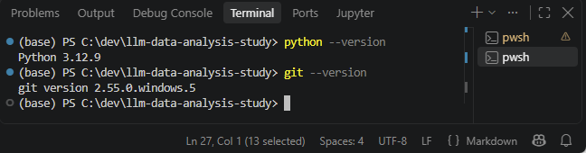
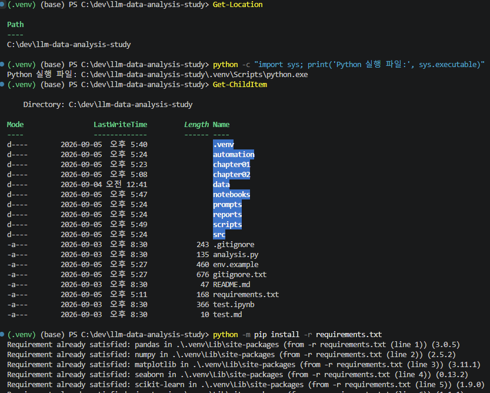
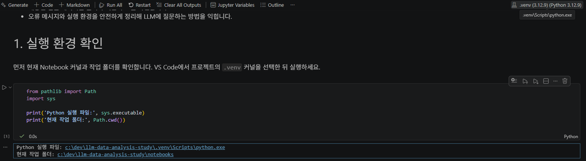
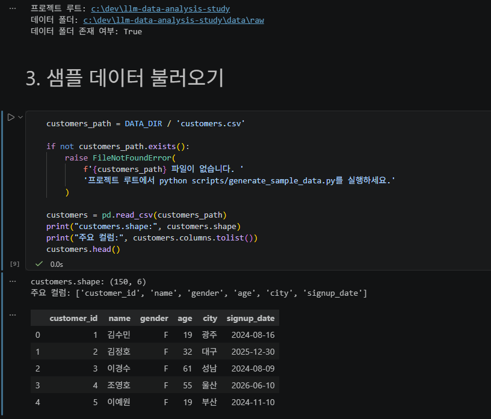
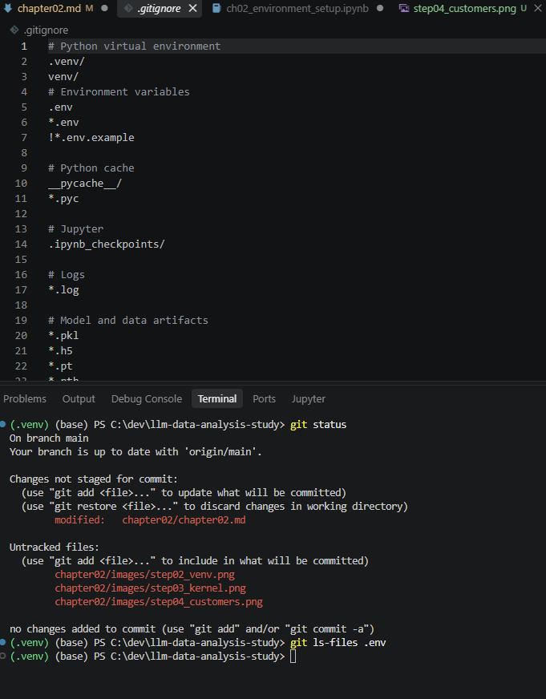

# Chapter 02 제출 답안. VS Code에서 시작하는 데이터 분석 환경


## 0. 제출 정보

- 이름: 유은송
- GitHub ID:  song-03
- 개인 저장소: `llm-data-analysis-study`
- 작성일:
- 운영체제: Window 

### 최종 제출 URL

```text
https://github.com/song-03/llm-data-analysis-study/blob/main/chapter02/chapter02.md
```

---

## 1. Python과 Git 환경 확인

### 실행 내용

```text
python --version
git --version
```

### 실행 결과

```text
Python 3.12.9
git version 2.55.0.windows.5
```

### Evidence



### 결과 관찰
두 명령 모두 실행한 결과
python 버전의 경우 3.12.9, git 버전의 경우 2.55.0.windows.5가 표시되었다. 두 명령 모두 오류 없이 실행되었으며, 명령어를 찾을 수 없다는 오류 역시 뜨지 않았다. 현재 PC에서 python과 git 을 사용할 수 있음을 확인했다.

### 나의 해석과 판단

현재 내 PC 환경에 수업 실습에 적합하다고 판단했다. python과 git 모두 오류없이 실행되었다. 따라서 기본 실행 상태를 확인할 수 있었기 때문에 다음 단계로 진행할 수 있다고 생각했다. 

### 업무·분석적 의미

프로젝트 시작 전에 버전과 도구 상태를 확인하는 이유는, 추후 필요한 도구를 정상적으로 사용할 수 있는지 미리 점검하기 위함이다. 또한 이후 설정이나 코드 실행 중에 문제가 발생해 트러블 슈팅할 때, 도구와 관련된 원인을 제외하는 것에 도움이 될 수도 있다. 또한 재현성을 높이는 요소가 될 수 있다. 

### 한계와 추가 확인 사항

아직까지 python , git 이 정상적으로 실행되는지 여부만 확인하였다. .필요한 패키지가 정상적으로 설치 되는지, note book 등과 커널이 연결되는지, 가상환경이 생성되고 활성화되는지는 확인하지 못했다. 이 부분은 추가적으로 다음 단계에서 확인해야 한다.

---

## 2. 저장소와 `.venv` 준비

### 수행 내용

- [x] 공식 Public 저장소 clone
- [x] 프로젝트 루트 확인
- [x] `.venv` 생성
- [x] `.venv` 활성화
- [x] `requirements.txt` 설치

### 핵심 실행 결과

```text
현재 프로젝트 경로: C:\dev\llm-data-analysis-study
터미널 Python 실행 파일: C:\dev\llm-data-analysis-study\.venv\Scripts\python.exe
가상환경 활성화 여부: 활성화됨
패키지 설치 결과: requirements.txt의 패키지가 .venv 환경에 설치되어 있으며, 재실행 시 Requirement already satisfied로 확인됨
```

### Evidence



### 결과 관찰

터미널에서 sys. executable로 확인한 결과 python은 현재 C:\dev\llm-data-analysis-study\.venv\Scripts\python.exe 을 통해서 실행되고 있었다. 다시 말해서 현재 `python `은 `C:\dev\llm-data-analysis-study\.venv\Scripts\python.ex`를 가리키고 있었다. 또한 requirements.txt의 패키지를 실행하였고, 재설치하자 주요 패키지가 이미 설치되어 있음을 확인할 수 있었다. 현재 터미널에서 프로젝트 .venv 가상환경에 포함된 python과 패키지를 사용하고 있음을 확인할 수 있었다.


(폴더의 경우 llm-data-analysis-course가 아닌 llm-data-analysis-study로 저장하였다. 실습 md 에는 course로 나와있으나 처음 주차 슬랙에 안내된 가이드에서는 study로 안내되어 이를 기준으로 진행하였다.)

### 나의 해석과 판단

앞으로 분석하는 것에 있어서 시스템 Python과 프로젝트 `.venv`를 분리하는 작업은 필요한 작업이다. 그 이유는, 이를 통해 시스템 python과 프로젝트 `.vevn`를 분리함으로써 다른 프로젝트나 작업에서 사용하는 패키지 혹은 그 버전과 충돌하는 문제를 방지할 수 있기 때문이다. 프로젝트마다 사용하는 버전이나 필요한 라이브러리가 다를 수도 있으므로, 별도의 venv 가상 환경을 이용해서 독립적으로 현재 사용하는 프로젝트에 필요한 실행 환경만을 관리할 수 있다. 이번 실습을 통해 확인한 결과 실제 python 실행 파일이 `.venv`를 가리키고 있으므로 현재 프로젝트용 가상 환경이 정상적으로 실행되고 있다고 판단했다.

### 업무·분석적 의미

가상환경을 사용함으로써 다른 사람이 같은 프로젝트를 다시 실행할 때, 필요한 패키지를 requirments.txt 등 파일을 이용해 설치함으로써 같은 실행 환경을 구성할 수 있다. 이를 통해서 시스테 python 환경에 의존하는 정도를 줄이고, 분석 코드 재현성도 높일 수 있다. 패키지 충돌로 나타나는 오류나 환경 차이로 인해서 발생하는 오류를 방지할 수 있다. 

### 한계와 추가 확인 사항

현재 PC는 개인 pc이다. 여기에서는 .venv 형성과 패키지 설치가 정상적으로 이뤄졌으나, 보안 환경이 다른 회사나 기관의 pc에서는 가상환경 활성화나 패키지 설치가 제한될 수 있다. 따라서 다른 환경에서 실행하기 위해서는 미리 확인해보아야 한다. 또한 python 버전이나 운영 체제가 다른 경우 명령어를 다르게 사용해야 할 수도 있으며, 패키지 설치나 실행에 차이가 있을 수 있다. 다음 단계에서 pythoon 인터프리터, notebook 커널도 같은 .venv를 사용하는지 확인해야 한다. 

---

## 3. VS Code 인터프리터와 Jupyter 커널 연결

### 확인 결과

```text
VS Code Python 인터프리터: c:\dev\llm-data-analysis-study\.venv\Scripts\python.exe
Notebook sys.executable: c:\dev\llm-data-analysis-study\.venv\Scripts\python.exe
Notebook Path.cwd(): c:\dev\llm-data-analysis-study\notebooks
```


### Evidence



### 결과 관찰

터미널에서 확인한 Python 실행 파일과 Notebook의 sys.executable 결과가 모두 C:\dev\llm-data-analysis-study\.venv\Scripts\python.exe로 같은 것으로 나타났다. 따라서 터미널과 Jupyter Notebook이 같은 프로젝트 .venv 가상환경을 사용하고 있음을 확인했다. 또한 Notebook의 현재 작업 폴더는 C:\dev\llm-data-analysis-study\notebooks 였다. 

### 나의 해석과 판단

두 python의 .venv가 다를 경우 터미널에서 설치한 패키지를 notebook에서는 못 찾거나, 서로 다른 버전의 패키지를 사용하는 등의 문제가 발생할 수 있다. 이 경우 코든느 정상이어도 실행 환경 차이 등으로 인해서 오류가 발생할 수 있다고 생각한다. 따라서 이를 일치시키는 것이 중요할 것이다. 현재 확인한 결과 두 환경이 같은 .venv를 사용하고 있으므로 패키지 설치 환경, note book 실행 환경이 일치하다고 판단했고 이로 인한 문제는 발생하지 않을 가능성이 높다고 생각할 수 있었다. 

### 업무·분석적 의미

같은 가상 환경을 터미널과 notebook이 사용하도록 맞춰 두면 `ModuleNotFoundError`와 같은 환경 에러가 패키지가 설치되어 있는데도 notebook에서 찾지 못하는 오류를 줄일 수 있다. 또한 다른 사람이 같은 프로젝트를 실행할 때도 같은 python 환경을 기준으로 작업할 수 있기 때문에 재현성과 안정성을 높이는 것에도 도움이 된다. 


### 한계와 추가 확인 사항

notebook 화면에 .venv 라고 커널이 표시되어 있어도 실제 실행 파일이 내가 원하는 가상 환경을 가리킨다고 확신하기 어렵다. 따라서 커널 이름을 확인할 뿐만 아니라 `sys.executable`을 print해서 실제 python의 경로를 확인하는 작업 역시 필요하다.
현재는 python 실행 환경이 일치하는 것을 확인했는데, 이후 데이터 경로랑 customer.csv등 사용할 데이터 파일이 정상적으로 연결되는지도 추가적으로 확인해야 한다. 

---

## 4. 샘플 데이터와 Notebook 실행 검증

### 확인 결과

```text
DATA_DIR 존재 여부: O
customers.csv 존재 여부: O 
customers.shape: (150, 6)
주요 컬럼: 'customer_id', 'name', 'gender', 'age', 'city', 'signup_date'
```

### Evidence



### 결과 관찰

DATA_DIR 존재여부를 확인한 결과 True 로 나타났으며, customer.csv 파일 역시 정상적으로 불러올 수 있었다. 위치는 프로젝트 루트: c:\dev\llm-data-analysis-study, 데이터 폴더: c:\dev\llm-data-analysis-study\data\raw 였으며 데이터 폴더 존재 여부: True 였다. `customers.head()` 실행 결과 고객 데이터의 처음 5개 행이 표 형태로 출력되었고, 'customer_id', 'name', 'gender', 'age', 'city', 'signup_date' 등의 컬럼이 포함되어 있었다. 또한 `customer.shape`를 통해 확인한 결과 150행과 6행으로 이루어진 데이터임을 확인할 수 있었다.

### 나의 해석과 판단

python 가상환경과 pandas 패키지, jupyter notebook 커널, 프로젝트 경로, 데이터 경로, csv 파일이 서로 정상적으로 연결되어 있다고 판단할 수 있다. 파일.head() 역시 오류 없이 출력되었으므로 notebook이 실제로 데이터 파일을 찾고, pandas로 읽는 과정까지 정상적으로 작동하고 있다고 판단할 수 있었다.

### 업무·분석적 의미

스모크 테스트를 통해서 실행 환경이나 데이터 경로가 정상적으로 연결되어 있는지 확ㅇ니할 수 있다. 이를 통해서 분석에서 나중에 오류가 발생했을 때 분석 코드 문제인지, 환경 문제인지 구분하기 쉬워지고, 경로가 잘못되어 있거나 패키지 설정 등으로 인해서 분석으로 다시 진행해야 하는 상황을 방지할 수 있으므로 생산성이 증가한다.

### 한계와 추가 확인 사항

현재는 customer.csv 파일이 정상적으로 로드되고 기본 구조가 출력되는지만 확인했다. 아직 결측치나 데이터 타입이 적절한지, 값이 이상하진 않은지 등 데이터의 품질은 확인하지 않았다. 분석에 데이터가 적합한 형태인지 파악하기는 현재 결과만으로는 어려우므로, 이후 단계에서 데이터 구조나 품질을 파악해야 한다. 그리고 customer.csv 외 다른 data 파일은 아직 확인하지 않았으므로 이 역시 점검해야 한다.
---

## 5. 오류 해결 기록
`해당 없음`

### 오류 메시지
`해당 없음`


### 원인 후보
`해당 없음`


### 내가 확인한 순서
`해당 없음`

### 해결 방법
`해당 없음`

### Evidence
`해당 없음`

### 나의 해석과 판단
`해당 없음`

### 한계와 추가 확인 사항
`해당 없음`

---

## 6. Secret 보호 확인

- [x] `.env`는 Git 추적 대상이 아닙니다.
- [x] 실제 API Key를 코드에 작성하지 않았습니다.
- [x] 캡처 화면에 Token/비밀번호가 없습니다.
- [x] `.venv`를 Git에 올리지 않습니다.

### Evidence




### 나의 해석과 판단

.gitignore에 .env와 .venv/ 파일이 제외 대상으로 작성되어 있고, git status에서도 .env, .venv가 표시되지 않으며 ,git ls-files .env 실행 결과 출력되지 않아 .env가 git의 추적 대상이 아니라고 판단할 수 있었다. 따라서 환경 설정 파일, 가상 환경 등이 public한 깃허브에 업로드될 위험이 낮은 상태라고 판단했다.
이처럼 환경 파일과 비밀 정보를 업로드 파일과 분리하는 것은 개인정보나 민감한 정보가 외부에 노출되는 것을 방지하기 위해 피요하다. 예를 들어 APi key, Token, 비밀번호 등이 업로드되면 해킹당하거나 악용이 발생할 수 있으므로 주의해야 한다. .venv 역시 파일 자체를 저장소에 올리기보다는 패키지 목록을 담은 txt 파일 들을 업로드해서 각 사용자가 직접 자기 환경에서 생성하는 것이 저장소 관리나 재현성 면에서 적절하다고 생각했다. 

---

## 7. Chapter 02 최종 회고

### 가장 중요했다고 생각한 환경 설정 1가지

```text
터미널 Python, VS Code 인터프리터, Jupyter Notebook 커널을 모두 같은 .venv 가상환경으로 맞추는 것이 가장 중요하다고 생각한다. 
```

### 그 이유

```text
같은 프로젝트 안에서 서로 다른 python 환경을 사용하면, 터미널에서 설치한 패키지를 notebook에서 못 찾거나 다른 버전을 사용하는 등의 문제가 발생할 수 있다. 어떻게든 다른 버전을 사용하는 경우 당장은 실행이 될 수도 있으나, 이후 오류가 발생했을 때 추적하기 어렵고 처음부터 시작하는 등 문제가 생길 수도 있다. 따라서 처음부터 커널 이름을 확인하고, sys.executable 등으로 직접 확인해서 같은 .venv임을 미리 확인해두면 이후 환경 차이로 인한 오류를 줄일 수 있고, 시간 역시 절약할 수 있기 때문에 중요하다고 생각했다. 

```

### 다음 Chapter에서 재사용할 환경 체크 3가지

1. jupyter notebook 커널과 VS cod python 인터프리터가 같은 .venv를 가리키는지 확인하고, sys.executable 등을 이용해 현재 python이 프로젝트의 .venv를 가리키는지 확인한다.
2. path.cwd()와 데이터 경로 등을 확인해 필요한 데이터 파일을 정상적으로 찾고 불러오는지 확인한다. 
3. .gitignore 파일에 .env 등 업로드되어서는 안되는 민감 정보가 제대로 저장되어 있는지 확인하고, git ls-file 등의 명령어를 이용해 추적되지 않는 상태인지 확인한다. 

### 현재 환경의 한계 또는 주의점

```text
현재 개인 PC에서는 python 및 가상환경에서 정상적으로 실습이 진행되었지만, 특정 기관이나 회사 등의 pc는 보안 환경이나 버전, 운영 체제 등이 다를 수 있으므로 무조건 동일하게 동작할 것이라 기대하기는 어렵다. 또한 커널 이름만 보고 환경이 일치한다고 판단해서는 안 되며, sys.executable 등을 이용해 한 번 더 확인해봐야 한다. 또한 민감 정보가 노출되지 않도록 항상 주의해야 한다. 
```

---

## 최종 제출 체크

- [x] 핵심 Evidence 4~7장을 첨부했습니다.
- [x] 단순 캡처가 아니라 관찰과 판단을 작성했습니다.
- [x] Secret/개인정보가 없습니다.
- [x] GitHub에서 이미지가 정상 표시됩니다.
- [x] 개인 저장소에 `chapter02/chapter02.md`를 업로드했습니다.
- [x] 저장소 URL이 아니라 최종 파일 URL을 제출합니다.