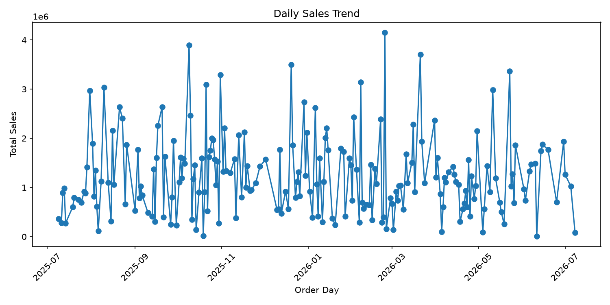

# Chapter 14 Airflow 자동화 보고서

## 1. 실행 개요

온라인 쇼핑몰 데이터 분석 파이프라인을 입력 확인, 전처리, 분석, 시각화, 보고서 생성, 산출물 검증 단계로 나누어 실행했습니다.

## 2. 주요 결과

- 총매출: 255,610,000
- 총 주문 수: 300
- 매출 1위 카테고리: 스포츠

## 3. 파이프라인 Task 요약

```text
                task_id                         purpose                                                    main_input                                                   main_output
      check_input_files              원본 CSV 4개 존재 여부 확인                                                data/raw/*.csv                                                      입력 확인 결과
      run_preprocessing 문자열 공백, 날짜, 숫자형, line_total 전처리                                                data/raw/*.csv                                    data/processed/*_clean.csv
           run_analysis             일자별 매출과 카테고리별 매출 계산                                    data/processed/*_clean.csv reports/ch14_daily_sales.csv, reports/ch14_category_sales.csv
generate_visualizations                일자별 매출 추이 그래프 생성                                  reports/ch14_daily_sales.csv                          reports/figures/ch14_daily_sales.png
        generate_report              Markdown 자동 보고서 생성 reports/ch14_daily_sales.csv, reports/ch14_category_sales.csv                                reports/ch14_airflow_report.md
       validate_outputs          주요 산출물 존재 여부와 파일 크기 검증                  data/processed, reports, reports/figures 산출물                       reports/ch14_airflow_validation_log.csv
```

## 4. 카테고리별 매출

```text
category  total_quantity  total_sales  sales_ratio
     스포츠             468     50174000        19.63
      뷰티             376     47551000        18.60
    전자기기             401     41003000        16.04
    생활용품             390     34839000        13.63
      식품             240     33597000        13.14
      도서             238     24645000         9.64
      패션             220     23801000         9.31
```

## 5. 생성된 산출물

- `data/processed/customers_clean.csv`
- `data/processed/products_clean.csv`
- `data/processed/orders_clean.csv`
- `data/processed/order_items_clean.csv`
- `reports/ch14_daily_sales.csv`
- `reports/ch14_category_sales.csv`
- `reports/figures/ch14_daily_sales.png`
- `reports/ch14_airflow_report.md`
- `reports/ch14_airflow_validation_log.csv`

## 6. Docker/Airflow 실행 환경

이 보고서는 로컬 Python 실행 또는 Docker Compose 기반 Airflow DAG 실행으로 재생성할 수 있습니다. Docker 설치 방법은 별도 블로그 글을 참고하고, 이 저장소에서는 `automation/airflow/docker-compose.yml` 기준으로 Airflow를 실행합니다.

## 7. 해석 시 주의할 점

이 보고서는 자동으로 생성된 요약입니다. 매출 변화의 원인을 단정하려면 외부 데이터, 프로모션 정보, 계절성, 재고 상황 등 추가 데이터와 사람의 검토가 필요합니다.


